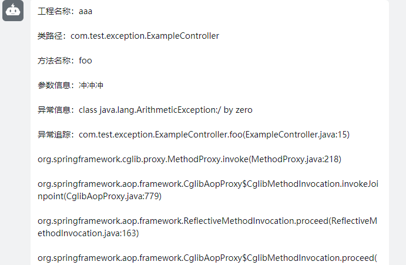

#### 基于SpringAOP的异常通知spring-boot-starter

**介绍**

本项目是适用于企业开发，个人开发者，在平时开发中这个项目可能一点忙都帮不上你，但是当你的项目开发完成并且上线之后，它的作用就发挥出来了，因为它将代替你监控你的工程
，在你不想去24小时不停盯着日志看是否报错的时候，在你下班或者休息的时间帮你照看你的项目， 直到它发生异常的时候，它将精准的把异常通过手机短信/钉钉来通知你项目的异常情况，这让你可以
在项目上线之后无需在让人一直守着它，甚至如果项目出问题的时候可以将锅直接甩到负责人身上， 而无需在它出异常的时候再去定位异常找出是谁写的，然后再通知他，这样效率很低，而本项目可以 自动化的将所有这一切令人不爽的工作自动化的处理，省时省力。

系统需求  \   \ 

**快速入门**

1.将本工程从git上拉下来

2.在你的工程的pom文件中将以下依赖加入

```xml
<dependency>
    <groupId>com.marvin</groupId>
    <artifactId>spring-boot-starter-calma</artifactId>
    <version>1.0.0</version>
</dependency>
```

3.在SpringBoot的配置文件：application.yml中做如下的配置：

```yaml
spring:
  application:
    name: #项目名称，这里和project-name都可以给项目配置名称
piracy:
  exceptionnotice:
    enabled: true #开启异常通知
    listen-type: common #普通模式
    project-name: a example project #项目名称
#Sms配置
#  sms:
#    enable: true #开启短信通知
#    regionId: 阿里云短信的regionId
#    accessKey: 阿里云短信的accessKey
#    secret: 阿里云短信的密钥
#    phoneNumbers: 你的手机号
#    signName: 阿里云短信的签名
#    templateCode: 阿里云短信的模板码
#钉钉
  dingding:
    enable: true #开启钉钉通知
    msgtype: text #发送的消息格式，暂时我还没有做markdown
    phone: #你的手机号
    is-all: true #这个暂时没做
    access_token: #钉钉机器人的token
    secret: #钉钉机器人的密钥
```

tips：至于钉钉的配置请移步：钉钉机器人,注意订单机器人的钩子webhook 上面的步骤都完成之后，就可以测试这个starter有多好用了

[钉钉机器人]:https://developers.dingtalk.com/document/app/custom-robot-access

```java

@Component
@PiracyExceptionListener // 异常通知的监控来自这个注解
public class ExceptionTest {

    public void testException(String param) {
        System.out.println("参数：" + param);
        throw new IllegalArgumentException("异常");
    }

}

```

测试

```java

@RunWith(SpringRunner.class)
@SpringBootTest
public class DemoApplicationTests {

    @Autowired
    private ExceptionTest exceptionTest;

    @Test
    public void contextLoads() {
        exceptionTest.testException("冲冲冲！");
    }
}
```
然后你的钉钉就会钉d=====(￣▽￣*)b的一声


到这里测试就完成了，可以快乐的当一个帅锅侠了

--------------------------------------------------------------------

从这开始讲解如何在web模式下使用本框架

1.将本工程从git上拉下来

2.在你的工程的pom文件中将以下依赖加入

```xml
<dependency>
    <groupId>com.marvin</groupId>
    <artifactId>spring-boot-starter-calma</artifactId>
    <version>1.0.0</version>
</dependency>
```

3.在SpringBoot的配置文件：application.yml中做如下的配置：

```yaml
spring:
  application:
    name: #这里和project-name都可以配置项目名称
piracy:
  exceptionnotice:
    enabled: true #开启异常通知
    listen-type: web #区别是这里是web，开启了web模式的征途了
    project-name: a example project #项目名称
  #Sms配置
  #  sms:
  #    enable: true #开启短信通知
  #    regionId: 阿里云短信的regionId
  #    accessKey: 阿里云短信的accessKey
  #    secret: 阿里云短信的密钥
  #    phoneNumbers: 你的手机号
  #    signName: 阿里云短信的签名
  #    templateCode: 阿里云短信的模板码
  #钉钉
  dingding:
    enable: true #开启钉钉通知
    msgtype: text #发送的消息格式，暂时我还没有做markdown
    phone: #你的手机号
    is-all: true #这个暂时没做
    access_token: #钉钉机器人的token
    secret: #钉钉机器人的密钥
```
第二步，当然是写个控制器了，你还在期待什么
```java
@RestController
@PiracyExceptionListener//写在这里可以让所有的方法都被监控
public class ExampleController{

  @GetMapping("/testFoo")
  //@PiracyExceptionListener当然标注在某个方法上面就只监控被标注的方法
  public void foo(String param){
    int i = 1/0;
  }
  
  @PostMapping("/testFoo")
  public void foo(Integer param){
    param = param/0;
  }
  
}
```
然后你的钉钉再一次钉d=====(￣▽￣*)b

到这里为止，web模式的这个测试也完了，还不快点去试试？

未完待续.............(有问题请联系我的Email：1261626796@qq.com，最近有点忙)

下个版本的期待：

1.支持MarkDown模式的异常通知消息

2.支持微服务的监控通知

_ps:下个版本将会先出markdown配置的功能，（感谢大家没有因为这个readme这么拉跨还支持本框架，我会抽时间把它给完善好的）_
